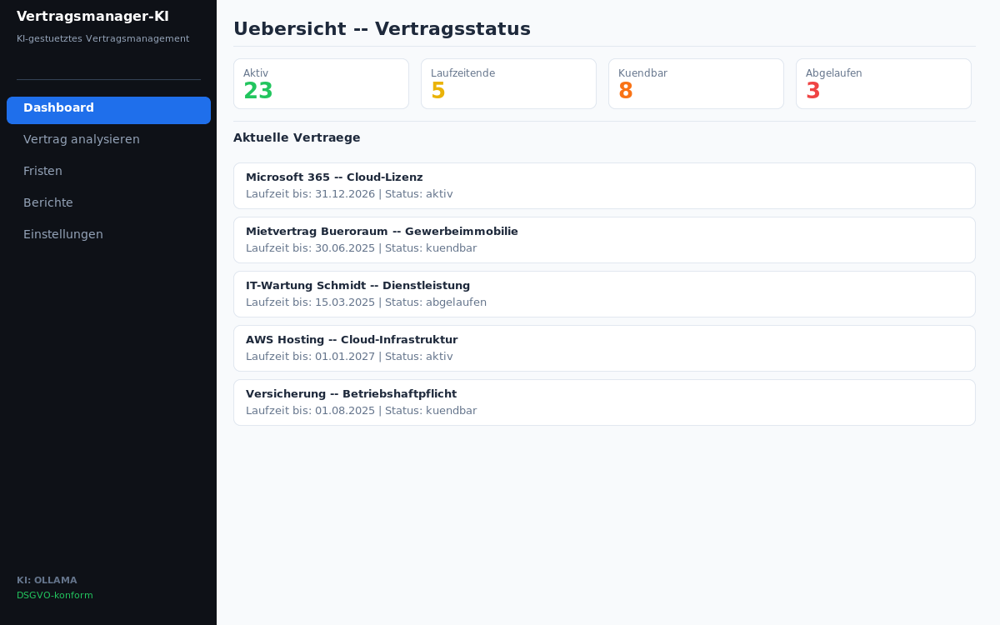
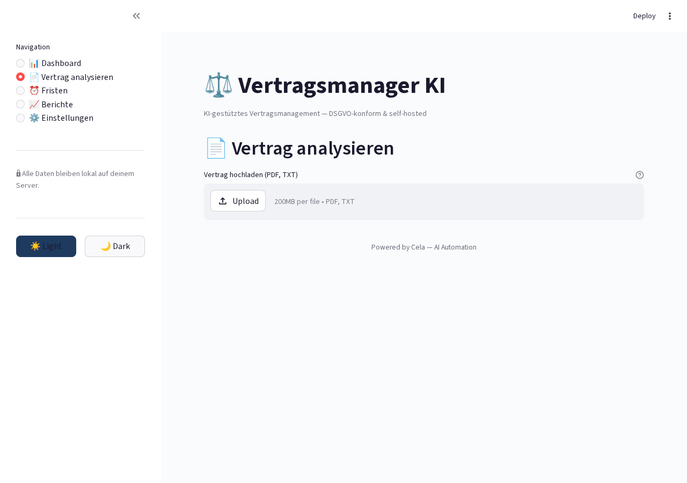
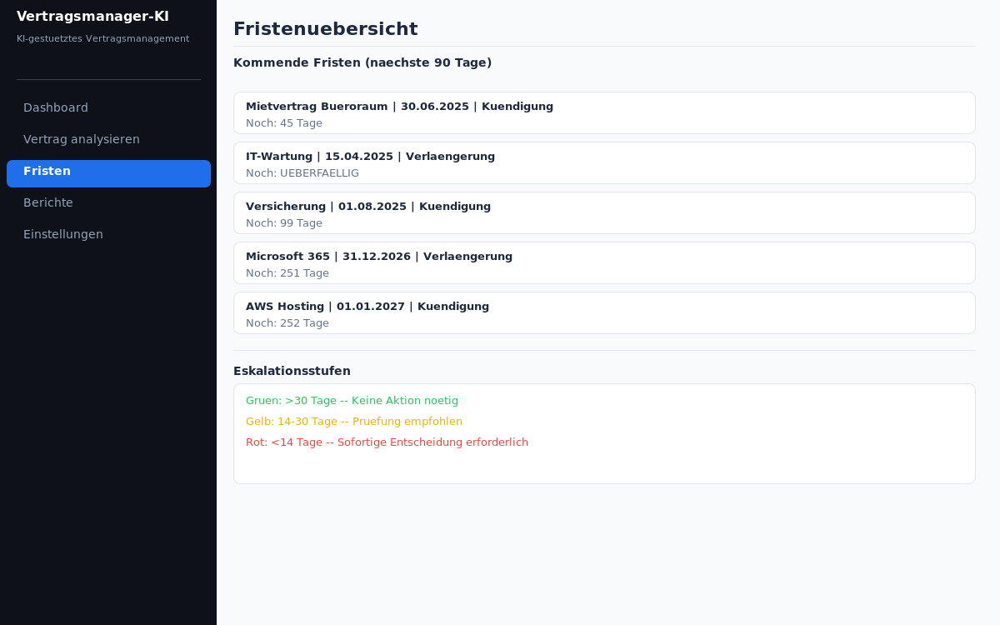

# Vertragsmanager Ki

<p align="center">
</p>

    

> KI-gestütztes Vertragsmanagement mit automatischer Klauselerkennung (DSGVO-konform)

## Overview

Automatische Vertragsanalyse mit KI. Erkennt Klauseln, überwacht Fristen, warnt vor Risiken. Self-hosted mit Ollama, DSGVO-konform.

## Features

- Automatische Klauselerkennung
- Fristenüberwachung mit Erinnerungen
- Risiko-Bewertung
- Vertragsdatenbank
- KI-gestützte Zusammenfassung
- DSGVO-konforme Speicherung

## Tech Stack

| Tech | Zweck |
|------|-------|
| Python 3.11+ | Backend |
| Streamlit | Web-Interface |
| Ollama | Lokale KI |
| SQLite | Datenbank |
| Docker | Deployment |

## Quick Start

```bash
pip install -r requirements.txt
streamlit run app.py
```

## Screenshots

**Dashboard mit Vertragsübersicht**



**Vertragsanalyse**



**Fristenübersicht**



---

## Contributing

Beiträge sind willkommen! Bitte erstelle einen Issue oder Pull Request.

## License

MIT License — siehe [LICENSE](LICENSE).

<p align="center">
</p>